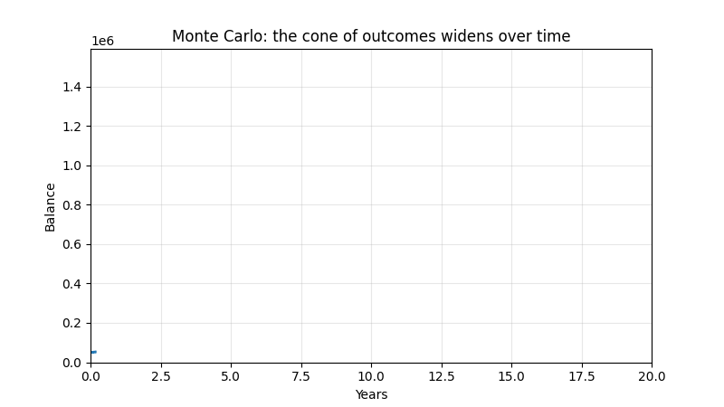
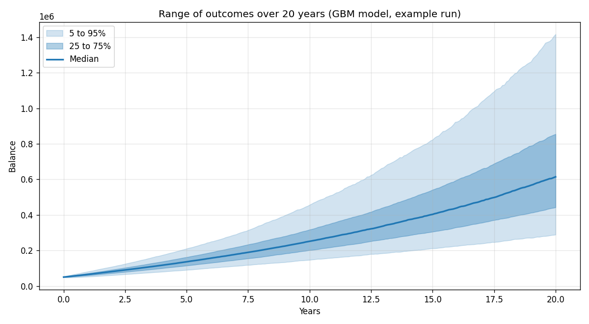
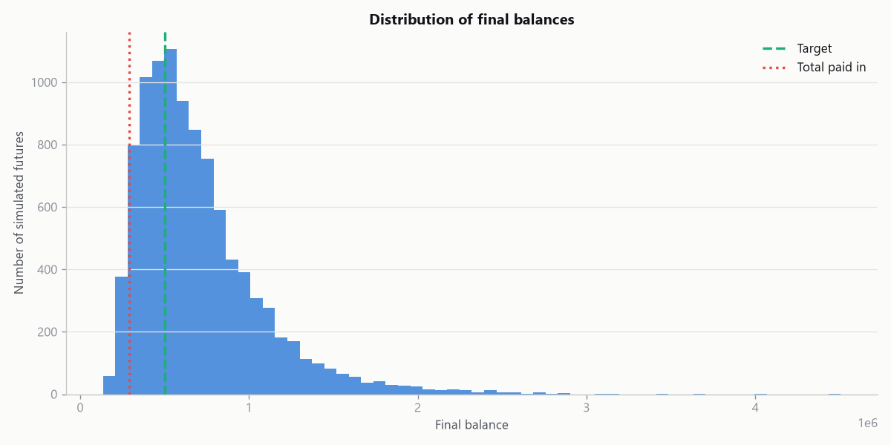

# Monte Carlo Simulation

A Monte Carlo engine that answers one concrete financial question: if I start
with a balance, add to it every year, and let it ride in the market for a couple
of decades, what is the range of outcomes, and how likely am I to hit my goal?

The point is not to predict a single number. It is to take uncertainty
seriously. Instead of asking "what return should I assume," this runs thousands
of plausible futures and reports the whole spread: the good, the median, and the
genuinely bad.

## The question, stated precisely

Given a starting balance, a fixed yearly contribution, a horizon in years, and a
target, the simulation reports:

- the median final balance, and the 5th and 95th percentiles around it
- the probability of reaching the target
- the probability of ending with less than you actually paid in
- the downside tail, as value at risk and conditional value at risk

Choosing this question is half the project. A Monte Carlo run is only as useful
as the decision it informs, and "will my savings plan get me there, and what
does a bad outcome look like" is a decision real people face.

## Example output

The charts come straight from the plotting code in this repo, from the default
config (start 50,000, add 12,000 a year for 20 years, 7% expected return, 15%
volatility, target 500,000) with a fixed seed, so you can reproduce them exactly
with `python scripts/run_simulation.py --save-plots`.

The fan chart shows how the range of outcomes widens the further out you look.
Uncertainty compounds, and this animation makes that growth visible as the
projection marches forward year by year:





The histogram shows where the thousands of final balances land, with the target
and the total-paid-in lines marked:



A run with those defaults prints something like this:

```
Total paid in over 20 years: 290,000
Target: 500,000

Median outcome                             614,347
5th percentile                             288,852
95th percentile                          1,417,363
Mean outcome                               702,661
Probability of hitting target                66.7%
Probability of ending below contributions     5.1%
Value at risk (5%)                         288,852
Conditional VaR (5%)                       247,669
```

The mean sitting well above the median is the lognormal shape at work: a few
very good paths drag the average up, which is exactly why the median and the
percentiles tell you more than the average alone.

## Two return models, and why the choice matters

| Model       | What it does                                  | The catch                          |
|-------------|-----------------------------------------------|------------------------------------|
| `gbm`       | Draws returns from a normal distribution      | Real markets have fatter tails than normal, so it understates extreme moves |
| `bootstrap` | Resamples actual historical returns           | Assumes the future is drawn from the same distribution as the past |

The GBM model is the textbook starting point and needs no data. The bootstrap
model resamples real history (any ticker you point it at), so it keeps the fat
tails and skew that were actually there. Switch with `--model bootstrap`.

Neither is "correct." They are two different bets about what tomorrow looks
like, and seeing how the answer changes between them is more informative than
trusting either one on its own.

## How it works

| Module          | Responsibility                                            |
|-----------------|-----------------------------------------------------------|
| `models.py`     | Generate per-step returns (GBM or bootstrap)              |
| `simulation.py` | Roll returns forward into balance paths, with contributions |
| `analysis.py`   | Percentiles, probability of target, VaR and CVaR          |
| `plotting.py`   | The fan chart and the final-balance histogram             |
| `data.py`       | Load price history for the bootstrap model, behind a loader |

## Getting started

```bash
git clone https://github.com/KelsonLam/monte-carlo-simulation.git
cd monte-carlo-simulation
pip install -r requirements.txt
python scripts/run_simulation.py
```

Edit `config.yaml` to set your own numbers, or override on the command line:

```bash
# A longer horizon with the bootstrap model, and the charts saved
python scripts/run_simulation.py --model bootstrap --years 30 --save-plots
```

## Being honest about the assumptions

- **Returns are assumed independent across periods.** Neither model captures
  momentum or mean reversion, so real sequences of returns can be more or less
  forgiving than what is simulated. Sequence-of-returns risk is real and this
  baseline does not model it directly.
- **The inputs are guesses.** With the GBM model, the answer is only as good as
  the expected return and volatility you feed it. Small changes in those
  assumptions move the result a lot, so it is worth running a few.
- **The bootstrap leans on history.** Resampling past returns assumes the future
  is drawn from the same distribution. A regime that never appeared in the
  sample window cannot appear in the simulation.
- **No inflation, taxes, or fees.** Balances are nominal and gross. For a real
  plan, those three matter and would all push outcomes down.

## Block bootstrap

The plain bootstrap draws one return at a time, throwing away any serial
structure. `block_bootstrap.py` resamples contiguous blocks instead, so
volatility clustering and streaks travel together into the simulated paths.

```python
from monte_carlo.block_bootstrap import BlockBootstrapModel
model = BlockBootstrapModel(historical_monthly_returns, block_size=6)
```

Set `block_size=1` and it reduces to the ordinary bootstrap.

## Tests

```bash
pip install pytest
pytest
```

The suite is deterministic where it can be: it checks that the GBM model is
arbitrage-free in the mean (average growth matches the target return), that zero
volatility is exactly deterministic, that the bootstrap only ever draws values
that were in the history, that contributions compound correctly, and that the
percentiles and tail measures are ordered sensibly.

## Project layout

```
monte-carlo-simulation/
├── config.yaml
├── requirements.txt
├── scripts/
│   └── run_simulation.py
├── src/monte_carlo/
│   ├── models.py
│   ├── simulation.py
│   ├── analysis.py
│   ├── plotting.py
│   └── data.py
└── tests/
    └── test_simulation.py
```

## License

MIT. See [LICENSE](LICENSE).
